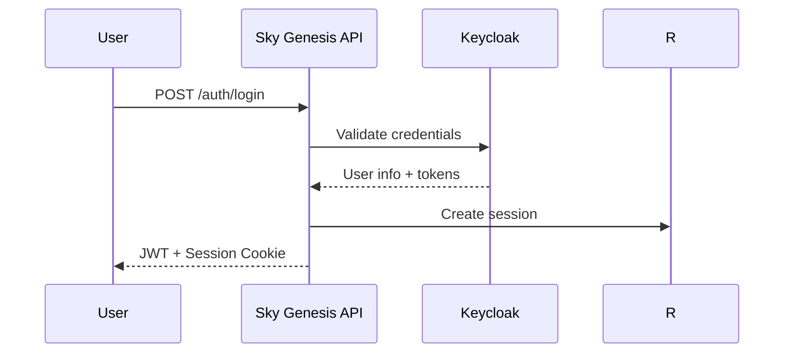
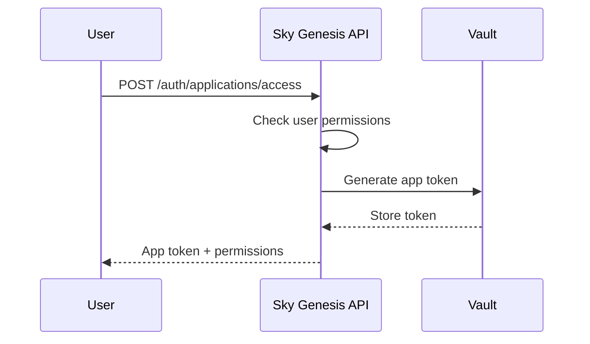
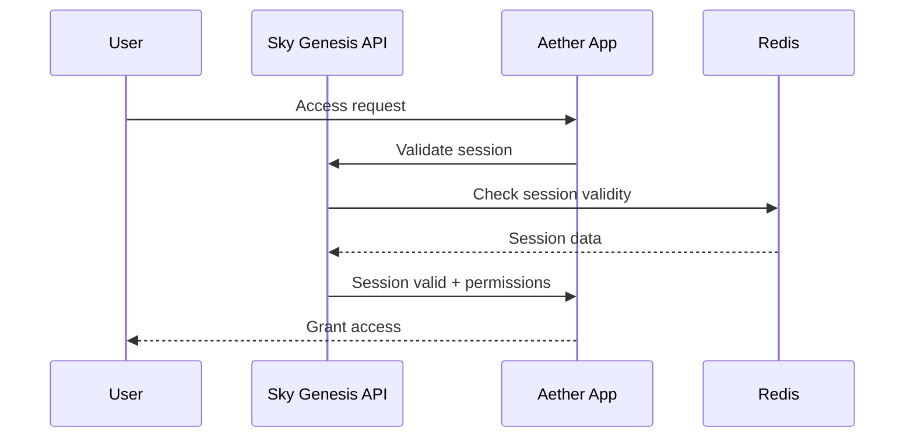

# 🌐 Sky Genesis Ecosystem - One Account for All

This document describes the architecture of the unified Sky Genesis ecosystem where **a single user account allows access to all applications**.

## 📋 Overview

The Sky Genesis Enterprise API acts as a **centralized intermediary** for authentication and authorization throughout the entire ecosystem. This approach enables:

- 🔐 **Single Authentication**: One login for all applications
- 🎯 **Granular Permissions**: Access control per application and feature
- 🔄 **Shared Sessions**: Seamless navigation between applications
- 🛡️ **Centralized Security**: Access management and revocation from a single point

## 🏗️ Architecture

```
┌─────────────────┐    ┌─────────────────┐
│   Aether Search │    │   Aether Mail   │
│                 │    │                 │
│  ┌────────────┐ │    │  ┌────────────┐ │
│  │ App Token  │ │    │  │ App Token  │ │
└─┼────────────┼─┘    └──┼────────────┼─┘
  │                      │
  └─────────┬────────────┘
            │
            ▼
     ┌─────────────────┐
     │   API Service   │
     │                 │
     │  ┌────────────┐ │
     │  │Session Mgr │ │
     │  ├────────────┤ │
     │  │App Service │ │
     │  ├────────────┤ │
     │  │ Keycloak   │ │
     │  └────────────┘ │
     └─────────────────┘
            │
            ▼
     ┌─────────────────┐
     │     Vault       │
     │  (Secrets)      │
     └─────────────────┘
```

## 🔑 Key Components

### 1. **Session Service**
- Management of shared sessions between applications
- Storage in Redis for performance
- Automatic expiration and cleanup

### 2. **Application Service**
- Catalog of ecosystem applications
- Management of permissions per application
- Generation of specific tokens

### 3. **Application Tokens**
- Tokens dedicated to each application
- Application-specific permissions
- Independent expiration from sessions

## 📱 Ecosystem Applications

### Aether Search
- **URL** : `https://search.skygenesisenterprise.com`
- **Permissions** : `search:read`
- **Description** : Moteur de recherche intelligent

### Aether Mail
- **URL** : `https://mail.skygenesisenterprise.com`
- **Permissions** : `mail:read`, `mail:write`
- **Description**: Unified messaging service

### Aether Drive
- **URL** : `https://drive.skygenesisenterprise.com`
- **Permissions** : `drive:read`, `drive:write`
- **Description**: Secure cloud storage

### Aether Calendar
- **URL** : `https://calendar.skygenesisenterprise.com`
- **Permissions** : `calendar:read`, `calendar:write`
- **Description**: Collaborative calendar manager

## 🔄 Authentication Flow

### 1. **First Login**


### 2. **Application Access**


### 3. **Application Access Request**


### 2. **Application Access**


### 3. **Application Access Request**


## 🛠️ API Endpoints

### Application Management

#### `GET /auth/applications`
Returns the list of applications accessible by the user.

**Response:**
```json
[
  {
    "id": "aether-mail",
    "name": "Aether Mail",
    "description": "Email service for Sky Genesis Enterprise ecosystem",
    "base_url": "https://mail.skygenesisenterprise.com",
    "user_permissions": ["mail:read", "mail:write"]
  }
]
```

#### `POST /auth/applications/access`
Requests access to a specific application.

**Request:**
```json
{
  "application_id": "aether-mail",
  "requested_permissions": ["mail:read", "mail:write"]
}
```

**Response:**
```json
{
  "application": {
    "id": "aether-mail",
    "name": "Aether Mail",
    "base_url": "https://mail.skygenesisenterprise.com"
  },
  "access_token": "app_token_123",
  "refresh_token": "refresh_token_456",
  "permissions": ["mail:read", "mail:write"],
  "expires_in": 3600
}
```

### Session Management

#### `POST /auth/session/login`
Login using an existing session.

#### `GET /auth/sessions`
List of user's active sessions.

#### `POST /auth/logout`
Logout of current session.

#### `POST /auth/logout/all`
Logout of all sessions.

## 🔐 Security

### Hierarchical Tokens
1. **Session Token**: Cookie shared between applications
2. **JWT**: Internal authentication token
3. **Application Tokens**: Application-specific tokens

### Permissions
- **Granular**: Control per feature
- **Contextual**: Based on user roles
- **Auditable**: Access traceability

### Revocation
- **Per Session**: Logout of a specific session
- **Per Application**: Revocation of access to an application
- **Global**: Logout of all sessions

## ⚙️ Configuration

### Environment Variables

```bash
# Applications
AETHER_SEARCH_URL=https://search.skygenesisenterprise.com
AETHER_MAIL_URL=https://mail.skygenesisenterprise.com
AETHER_DRIVE_URL=https://drive.skygenesisenterprise.com
AETHER_CALENDAR_URL=https://calendar.skygenesisenterprise.com

# Default Permissions
AETHER_SEARCH_PERMISSIONS=search:read
AETHER_MAIL_PERMISSIONS=mail:read,mail:write
AETHER_DRIVE_PERMISSIONS=drive:read,drive:write
AETHER_CALENDAR_PERMISSIONS=calendar:read,calendar:write

# Sessions
SESSION_TTL_SECONDS=604800
SESSION_COOKIE_DOMAIN=skygenesisenterprise.com
```

## 🚀 Deployment

### Recommended Architecture

```
Internet
    │
    ▼
┌─────────────┐
│   NGINX     │  (Load Balancer)
│  (Reverse   │
│   Proxy)    │
└─────────────┘
        │
        ▼
┌─────────────┐    ┌─────────────┐
│  Sky API    │    │   Keycloak  │
│  (Primary)  │◄──►│  (Auth)     │
└─────────────┘    └─────────────┘
        │
        ▼
┌─────────────┐    ┌─────────────┐
│   Redis     │    │   Vault     │
│ (Sessions)  │    │  (Secrets)  │
└─────────────┘    └─────────────┘
```

### High Availability

- **API**: Load balancing with sticky sessions
- **Redis**: Cluster for session persistence
- **Vault**: Replication for redundancy
- **Keycloak**: High availability cluster

## 📊 Monitoring

### Metrics to Monitor

- **Authentication success rate**
- **Number of active sessions**
- **Application response times**
- **Token revocation rate**

### Audit Logs

- **Successful/failed logins**
- **Application access**
- **Permission changes**
- **Session revocations**

## 🔧 Development

### Adding a New Application

1. **Add to ApplicationService**:
```rust
applications.insert("new-app".to_string(), Application {
    id: "new-app".to_string(),
    name: "New App".to_string(),
    description: "Description".to_string(),
    base_url: "https://new-app.skygenesisenterprise.com".to_string(),
    required_permissions: vec!["new-app:read".to_string()],
    is_active: true,
    created_at: chrono::Utc::now(),
});
```

2. **Add to .env.example**:
```bash
NEW_APP_URL=https://new-app.skygenesisenterprise.com
NEW_APP_PERMISSIONS=new-app:read,new-app:write
```

3. **Update documentation**

## 🎯 Advantages

- **🔄 Smooth User Experience**: Seamless navigation
- **🛡️ Enhanced Security**: Centralized authentication
- **⚡ Performance**: Redis cached sessions
- **🔧 Maintainability**: Centralized access management
- **📈 Scalability**: Easy addition of new applications

---

**🌟 One Account, Infinite Possibilities**