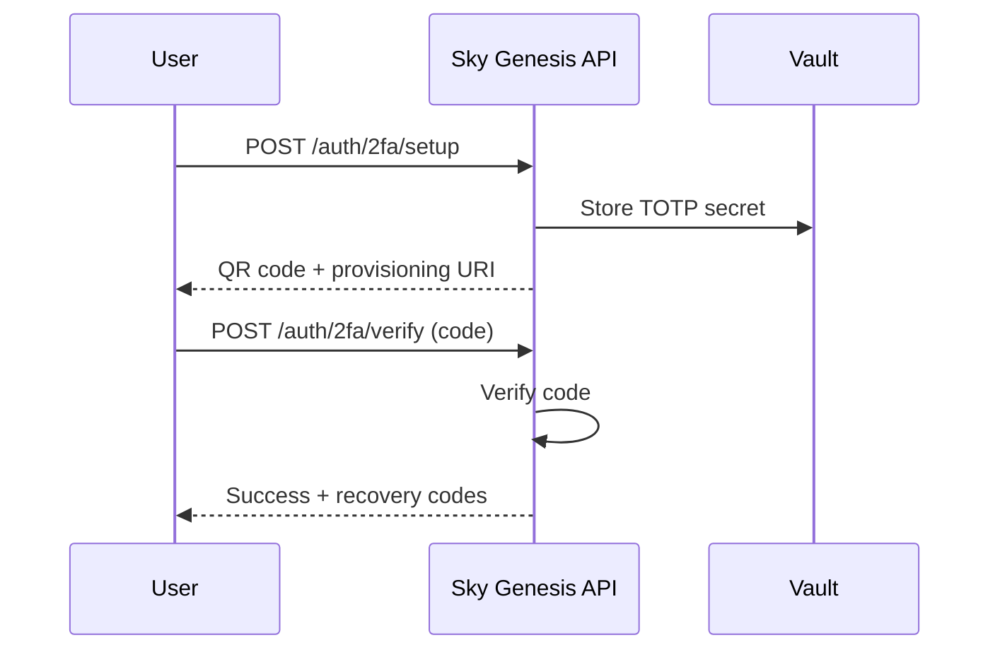
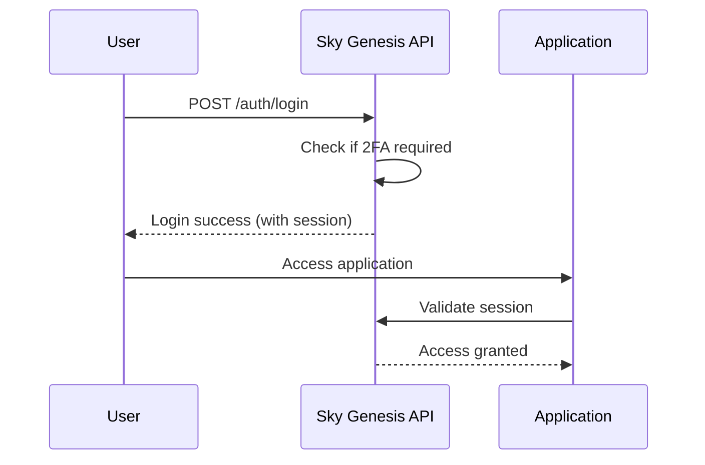

# 🔐 Two-Factor Authentication (2FA)

The Sky Genesis Enterprise API supports optional two-factor authentication (2FA), allowing sensitive applications to require additional verification to enhance security.

## 📋 Overview

2FA adds an extra layer of security by requiring two distinct forms of identification:
1. **First Factor**: Username + password (via Keycloak)
2. **Second Factor**: Code generated by an application or sent via SMS/email

## 🔑 Supported 2FA Types

### 1. **TOTP (Time-based One-Time Password)**
- Applications: Google Authenticator, Authy, Microsoft Authenticator
- Generation: Code changing every 30 seconds
- Advantages: Offline, no network dependency

### 2. **SMS**
- Sending codes via SMS to phone number
- Advantages: Simple, no application required
- Disadvantages: Dependent on mobile network

### 3. **Email**
- Sending codes via email
- Advantages: Accessible everywhere, no number required
- Disadvantages: Delivery delay

### 4. **Recovery Codes**
- One-time use codes for access recovery
- Advantages: Backup solution in case of access loss
- Usage: One code = one use

## 🔧 Per-Application Configuration

Certain applications may require 2FA for security reasons:

```bash
# Sensitive applications requiring 2FA
AETHER_MAIL_REQUIRES_2FA=true
AETHER_DRIVE_REQUIRES_2FA=true
AETHER_CALENDAR_REQUIRES_2FA=false
```

## 🚀 2FA Authentication Flow

### Initial Setup



### Authentication with 2FA



## 🛠️ API Endpoints

### 2FA Configuration

#### `POST /auth/2fa/setup`
Configure a new 2FA method.

**Request:**
```json
{
  "method_type": "TOTP",
  "name": "My Phone",
  "identifier": ""
}
```

**Response for TOTP:**
```json
{
  "method_id": "totp_123",
  "method_type": "TOTP",
  "provisioning_uri": "otpauth://totp/...",
  "qr_code_url": "https://api.qrserver.com/...",
  "verification_code": null
}
```

#### `POST /auth/2fa/verify`
Verifies and activates a 2FA method.

**Request:**
```json
{
  "method_id": "totp_123",
  "code": "123456"
}
```

**Response:**
```json
{
  "success": true,
  "method_type": "TOTP",
  "recovery_codes": ["1234-5678", "9876-5432", ...]
}
```

### Method Management

#### `GET /auth/2fa/methods`
List configured 2FA methods.

**Response:**
```json
[
  {
    "id": "totp_123",
    "user_id": "user_456",
    "method_type": "TOTP",
    "name": "My Phone",
    "identifier": "",
    "is_enabled": true,
    "is_primary": true,
    "created_at": "2024-01-01T00:00:00Z",
    "last_used": "2024-01-15T10:30:00Z"
  }
]
```

#### `DELETE /auth/2fa/methods/{method_id}`
Delete a 2FA method.

### Authentication

#### `POST /auth/login` (with 2FA required)
If the application requires 2FA and the user hasn't configured it:

```json
{
  "error": "Two-factor authentication is required for this application"
}
```

## 📱 Client-Side Integration

### TOTP Configuration

```javascript
// 1. Request configuration
const setup = await fetch('/auth/2fa/setup', {
  method: 'POST',
  headers: { 'Authorization': 'Bearer ' + token },
  body: JSON.stringify({
    method_type: 'TOTP',
    name: 'My Authenticator App'
  })
});

// 2. Display QR code
const qrImage = document.createElement('img');
qrImage.src = setup.qr_code_url;

// 3. Verify with generated code
const verify = await fetch('/auth/2fa/verify', {
  method: 'POST',
  headers: { 'Authorization': 'Bearer ' + token },
  body: JSON.stringify({
    method_id: setup.method_id,
    code: '123456' // Code from authenticator app
  })
});

// 4. Save recovery codes
if (verify.recovery_codes) {
  localStorage.setItem('recovery_codes', JSON.stringify(verify.recovery_codes));
}
```

### SMS Configuration

```javascript
// 1. Setup
const setup = await fetch('/auth/2fa/setup', {
  method: 'POST',
  body: JSON.stringify({
    method_type: 'SMS',
    name: 'My Phone',
    identifier: '+33123456789'
  })
});

// 2. Immediate verification (code sent via SMS)
const verify = await fetch('/auth/2fa/verify', {
  method: 'POST',
  body: JSON.stringify({
    method_id: setup.method_id,
    code: '123456' // Code received via SMS
  })
});
```

## 🔒 Security

### Secret Storage
- **TOTP secrets**: Encrypted in Vault
- **Recovery codes**: Stored encrypted, one-time use
- **Usage history**: Access traceability

### Best Practices
- **Secret rotation**: Regular rotation for TOTP
- **Attempt limitation**: Protection against brute force attacks
- **Code expiration**: SMS/email codes expire quickly
- **Audit logging**: All 2FA events are logged

### Access Recovery
1. **Recovery codes**: Backup solution
2. **Identity verification**: Manual process for admins
3. **Temporary deactivation**: Bypass possibility in emergencies

## ⚙️ Configuration

### Environment Variables

```bash
# Applications requiring 2FA
AETHER_MAIL_REQUIRES_2FA=true
AETHER_DRIVE_REQUIRES_2FA=true

# TOTP Configuration
TOTP_ISSUER=Sky Genesis Enterprise
TOTP_TIME_STEP=30

# Code Configuration
VERIFICATION_CODE_LENGTH=6
RECOVERY_CODES_COUNT=10

# External providers (production)
SMS_PROVIDER=twilio
EMAIL_PROVIDER=sendgrid
```

### Security Limits

```bash
# Verification attempts
MAX_VERIFICATION_ATTEMPTS=5
VERIFICATION_LOCKOUT_MINUTES=15

# Code expiration
SMS_CODE_EXPIRY_SECONDS=300
EMAIL_CODE_EXPIRY_SECONDS=600
```

## 📊 Monitoring

### Metrics to Monitor

- **2FA success rate**
- **Failed attempts**
- **Methods configured per user**
- **Recovery code usage**
- **External provider response times**

### Alerts

- **Repeated verification failure**: Possible attack
- **Recovery code usage**: Recovery action
- **2FA deactivation**: Security change

## 🔧 Development

### Adding a New 2FA Type

1. **Add enum** in `TwoFactorType`
2. **Implement logic** in `setup_two_factor` and `verify_two_factor`
3. **Add configuration** in `.env.example`
4. **Update documentation**

### Tests

```bash
# Unit tests
cargo test two_factor_

# Integration tests
cargo test --test integration two_factor
```

## 🚀 Deployment

### Migration of Existing Users

For applications requiring 2FA, existing users will need to configure 2FA during their next login.

### Progressive Rollout

1. **Phase 1**: Activation for new registrations
2. **Phase 2**: Notification of existing users
3. **Phase 3**: Mandatory activation for sensitive applications

## 📚 Additional Resources

- [RFC 6238 - TOTP](https://tools.ietf.org/html/rfc6238)
- [RFC 4226 - HOTP](https://tools.ietf.org/html/rfc4226)
- [OWASP 2FA Cheat Sheet](https://cheatsheetseries.owasp.org/cheatsheets/Multifactor_Authentication_Cheat_Sheet.html)

---

**🛡️ Enhanced Security • 🔐 Multi-Factor Authentication • 🚀 Smooth User Experience**